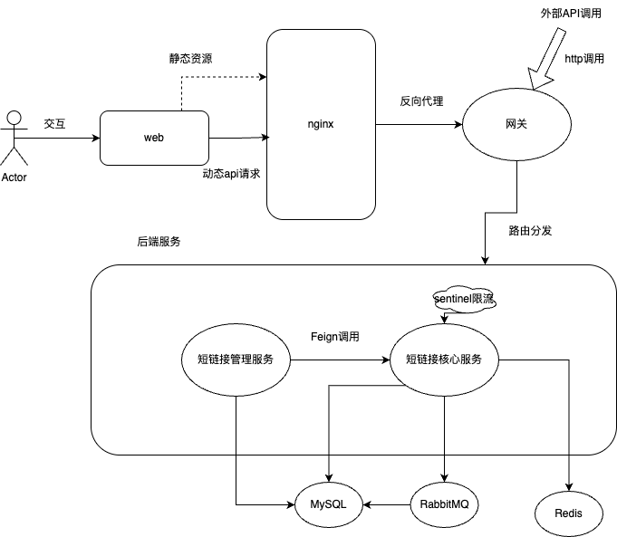

## 项目简介
**短链接系统**，为企业和个人用户提供了一个高效、安全和可靠的短链接管理平台。
该平台不仅简化了长链接的管理和分享过程，还提供了深入的分析和跟踪功能，用户可以灵活地管理和优化其链接，从而实现更好的营销效果和业务成果。

访问地址:http://49.234.192.196

用户名：admin   
密码：admin123456

暂未开放注册接口，仅用于演示与测试。

## 模块说明
- shortlink-admin ：管理后台模块，提供短链接管理和系统配置功能。
- shortlink-gateway ：网关模块，负责请求路由和负载均衡。
- shortlink-project ：核心业务模块，处理短链接的生成、解析及存储。
## 技术栈
- Spring Boot
- Spring Cloud Alibaba
- MyBatis-Plus
- Redis
- ShardingSphere
- RabbitMQ
- Sentinel
- Docker
## 构建与运行
1. 使用Maven构建项目： mvn clean install
2. 使用Docker构建镜像并运行容器，项目根目录下有 docker-compose.yml 文件支持多容器部署。
## 目录结构
```
shortlink-admin/ #管理后台模块
shortlink-gateway/ #网关模块
shortlink-project/ #核心业务模块
```
## 接口
### admin-group
- `PUT /api/short-link/admin/v1/group` 更新分组信息
- `DELETE /api/short-link/admin/v1/group` 删除分组
- `GET /api/short-link/admin/v1/group` 获取分组列表
- `POST /api/short-link/admin/v1/group` 新增分组
- `POST /api/short-link/admin/v1/group/sort` 更新分组顺序
### admin-link(调用project的远程方法)
- `POST /api/short-link/admin/v1/link` 创建短链接
- `GET /api/short-link/admin/v1/link/page` 分页获取短链接
- `POST /api/short-link/admin/v1/link/update` 更新短链接
### admin-recycle-bin(调用project的远程方法)
- `POST /api/short-link/admin/v1/recycle-bin` 移至回收站
- `POST /api/short-link/admin/v1/recycle-bin/delete` 删除短链接
- `POST /api/short-link/admin/v1/recycle-bin/page` 分页查询短链接
- `POST /api/short-link/admin/v1/recycle-bin/recover` 恢复短链接
### admin-user
- `PUT /api/short-link/admin/v1/user` 更新用户信息
- `GET /api/short-link/admin/v1/user/check-login` 检查用户登陆情况
- `GET /api/short-link/admin/v1/user/has-username` 检查是否存在用户名
- `POST /api/short-link/admin/v1/user/login` 用户登陆
- `DELETE /api/short-link/admin/v1/user/logout` 退出登陆
- `POST /api/short-link/admin/v1/user/register` 用户注册
- `POST /api/short-link/admin/v1/user/{username}` 根据用户名获取用户信息
### admin-stats
- `GET /api/short-link/admin/v1/stats` 获取短链接统计信息
- `GET /api/short-link/admin/v1/stats/access` 获取访问详情
### 其他
- `GET /api/short-link.admin/v1/url/title` 获取目标网站标题
### project-link
- `POST /api/short-link/v1/link` 创建短链接
- `GET /api/short-link/v1/link/count` 统计短链接数量
- `GET /api/short-link/v1/link/page` 短链接分页查询
- `POST /api/short-link/v1/link/update` 更新短链接
### project-page
- `POST /api/short-link/v1/recycle-bin` 移至回收站
- `POST /api/short-link/v1/recycle-bin/delete` 删除短链接
- `GET /api/short-link/v1/recycle-bin/page` 分组查询短链接
- `POST /api/short-link/v1/recycle-bin/recover` 短链接恢复
### project-stats
- `GET /api/short-link/v1/stats/access` 获取短链接访问详情
- `GET /api/short-link/v1/stats` 获取短链接访问统计详情
### 其他
- `/api/short-link/v1/url/title` 获取目标网站标题

## 系统架构
