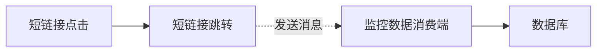

# 异步化统计

## 1. 背景与目标

### 1.1. 功能概述
短链接的监控数据是非常有价值的，比如短链接的点击量、uv、uip等。这些数据需要在用户点击短链接跳转时收集，但显然这与跳转的主逻辑不相关。为了不影响用户点击跳转的响应，应该把监控数据的收集异步化。

### 1.2. 设计目标
为了确保异步化统计的有效性和稳定性，需要达成以下设计目标：

#### 1.2.1. 幂等消息
确保消息处理的幂等性，即同一条消息被重复处理多次，其结果与只处理一次的结果相同。这对于防止因消息重发或消费者重复消费导致的数据不一致（例如，点击量重复统计）至关重要。实现方式可以考虑在消息中包含唯一标识符，并在处理前进行去重检查。

#### 1.2.2. 消息可靠性
保证消息在从生产到消费的整个生命周期中不丢失。这意味着即使在系统故障（如服务宕机、网络中断）的情况下，消息也能被可靠地传递和处理。实现方式通常涉及使用持久化的消息队列，以及生产者确认机制、消费者确认机制和死 信队列等。

#### 1.2.3 消息堆积考虑
考虑消息上游的发送效率，设计合理的消费端以避免消息堆积的情况

## 2. 流程图



## 3. 消息队列选型
现目前，市面上主流的消息队列包括: RabbitMQ、 RocketMQ、Kafka，下面是这几种消息队列的比较:

| 特性         | RabbitMQ                 | RocketMQ                     | Kafka                      |
| :----------- | :----------------------- | :--------------------------- | :------------------------- |
| 发送延迟     | 微秒级（单节点性能足够） | 毫秒级（略高于 RabbitMQ）    | 毫秒级（批量发送更优）     |
| 可靠性       | 支持持久化 + ack 机制，可靠 | 支持同步刷盘 + 副本，可靠    | 支持副本 + ack=all，可靠   |
| 功能丰富度   | 支持死信队列、优先级队列 | 支持事务消息、定时消息       | 功能极简，需自行实现扩展   |
| 运维复杂度   | 轻量（单节点部署即可用） | 中等（需配置多节点集群）     | 较高（依赖 ZK/Kraft）      |
| 适用消息量   | 万级 / 秒（单节点足够）  | 十万级 / 秒（单机）          | 百万级 / 秒（适合超大规模）|

在短链接系统中，跳转时记录用户 IP 等信息的场景核心需求是：**低延迟（不影响用户跳转体验）**、**高可靠（数据不丢失）**、**轻量易维护**。

### 3.1 低延迟优先
在用户点击短链接后，跳转过程需要在尽快完成，记录日志的操作必须异步化，不能阻塞主线程，因此消息队列发送消息要保证低延迟。

### 3.2 可靠性
尽可能保证消息不丢失，该场景下容许极小部分的异常情况丢失，可以通过配置死信队列，处理异常消息，减少消息异常而丢失情况

### 3.3 消息量中等
对于本系统，承载的消息量不会达到超高吞吐量需求(仅估计)

### 3.4 消息模式
仅需简单的生产-消费模式，可能需要配置死信队列，无需特别复杂的场景

因此考虑选择`RabbitMQ`作为消息队列选型，原因如下：
1. 满足低延迟、高可靠性的核心要求
2. 部署轻量，单机节点已足够(!重要)
3. 功能丰富(死信队列)

## 4. 具体实现

### 4.1 消息体设计

```java
public class StatsMessage {

    private Integer uv;

    private Integer newIp;

    private Date now;

    private String fullShortUrl;

    private String os;

    private String browser;

    private String device;

    private String network;

    private String user;

    private String adcode;

    private String province;

    private String city;

    private String ip;
}
```

同时包含消息队列send时的messageId

### 4.2 幂等性消费设计

在消息发送时附带一个`MessageId`， `MessageId`由UUID生成，在消费端使用Redis的set进行唯一性判断，如果发现已被消费过则丢弃

### 4.3 消息可靠性设计

消息可靠性需要从两个方面考虑:
1. 断电等情况下消息没有持久化导致消息丢失，因此在交换机和消息队列时设置消息持久化
2. 网络波动等情况，导致消息丢失，这里需要通过手动ack的方式确定保证消息消费，否则重发

## 其他

在异步化统计的过程中是否需要采用Redis + 批量更新的策略呢？在这种监控数据的场景下，应该都是用消息队列的，主要从几个方面考虑：

1. Redis引入 大大增加了系统的复杂性，也就是说需要考虑定时任务、缓存的一些处理问题
2. 突发流量下拓展性不好，同时可能存在热点key，大key等问题，会阻塞生产端影响跳转
3. 就开发而言，RabbitMQ的开发效率高，开箱即用，同时只需要发送消息比较简单


